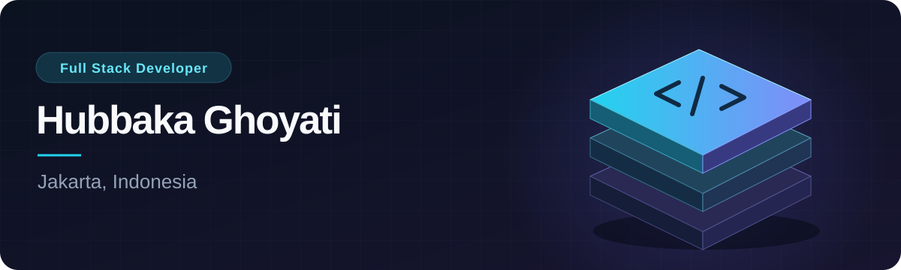

# Hi, Saya Hubbaka Ghoyati

Sebagai **Full-Stack Engineer** yang adaptif dan komunikatif, saya memiliki pengalaman merancang dan mengembangkan perangkat lunak secara _end-to-end_ untuk berkontribusi dalam memenuhi kebutuhan operasional serta bisnis perusahaan. Nyaman dan antusias berkolaborasi dalam tim maupun maupun indiviual untuk memecahkan tantangan teknis maupun non-teknis untuk memberikan kontribusi.

Hubungi saya : [Email](mailto:hubbaka.ghoyati456@gmail.com) / [Whatsapp](https://wa.me/628xxxxxxxxxx)

## Kontribusi Saya
[View contribution activity](https://github.com/hubbaka#year-list-container)

## Key Accomplishments

- **Mengembangkan Sistem HRIS (Prima Super Apps)**: Menggantikan sistem pihak ketiga berbayar (GreatDay senilai ±Rp 1,2 Miliar/tahun) dengan mengelola operasional ±50.000 pekerja secara mandiri, sekaligus membuka peluang pendapatan baru.
- **Mengembangkan Sistem Tracking Driver & Fleet Management**: Mengoptimalkan pelacakan armada dan profil pengemudi, berhasil mengefisiensikan biaya operasional kendaraan hingga **40%** tanpa mengurangi performa operasional.

## Areas of Expertise

- 🗣️ **Bahasa**: Indonesia & Inggris
- 🧠 **Prinsip & Metodologi**: Clean Code, Maintainability, Scalability, Problem Solving, Team Communication
- ⚙️ **Backend**: Golang (Fiber), Node.js (TypeScript), Python (Flask)
- 🎨 **Frontend**: Next.js, React.js, Flutter
- 🗄️ **Database**: PostgreSQL (Clustering), MySQL, Supabase, MongoDB
- ⚡ **Caching & Message Broker**: Redis, RabbitMQ, Kafka
- 🐳 **Infrastructure & Orchestration**: Docker, Kubernetes (Container Orchestration), Rancher (Multi-Cluster Management)
- 🌐 **Reverse Proxy & Web Server**: Nginx
- 🔒 **Networking & Security**: Cloudflare, DNS Management, SSL/TLS
- 🔄 **Version Control & CI/CD**: GitHub Actions, GitLab CI/CD
- 💻 **OS & Environment**: Linux, macOS, Windows

## Experience

### Prima Super Apps — HRIS

Multi-tenant HRIS for approximately 50,000 active users, integrated with internal company systems.

- Developed attendance features with photo and location verification, leave, overtime, payslips, reimbursements, and QR-based security patrols.
- Built multi-company administration, SSO, role-based access control, and Maker–Checker–Signer approval workflows.
- Developed microservices connecting HRIS, payroll, and third-party services through APIs and webhooks.

**Stack:** Go (Fiber), Next.js, PostgreSQL, Redis, RabbitMQ, Docker, Kubernetes

[Google Play](https://play.google.com/store/apps/details?id=com.pkss.app&hl=id) · [App Store](https://apps.apple.com/id/app/prima-super-apps/id6474478418)

### Fleet Management — Vehicle & driver operations

Vehicle monitoring and driver assignment platform that helped reduce vehicle operating costs by up to 40%.

- Developed live tracking, trip history, fuel/power consumption estimates, expense tracking, and incident reporting.
- Integrated HRIS authentication and built an Android head-unit interface, vehicle tax reminders, and driver scheduling.

**Stack:** TypeScript, Node.js, Next.js, Flutter, PostgreSQL, Redis, RabbitMQ, Docker

[View platform](https://fleet.pkss.co.id/)

### Prima Academy — Online assessments

Assessment and certification platform supporting approximately 5,000 concurrent users per exam session.

- Developed the online examination engine, question bank, results analytics, and automatic digital certificates.
- Integrated centralized authentication through Prima Super Apps SSO.

**Stack:** TypeScript, Node.js, Next.js, PostgreSQL, Redis, RabbitMQ, Docker

[View platform](https://primaacademy.pkss.co.id/)

### Influencer Engagement Platform — Social media analytics

- Developed data ingestion from Instagram, TikTok, and X/Twitter, engagement metrics, and campaign valuation calculations.
- Implemented audience sentiment analysis with NLTK and built influencer management and performance visualizations.

**Stack:** Python, Flask, BeautifulSoup, Selenium, Pandas, NLTK, React, MySQL, Docker

Additional work includes digital office approval workflows, SLA-based contact center ticketing, and invitation/event management. See my [resume](./resume_hubbaka_ghoyati.md) for the full scope of responsibilities.

## Experience

| Role | Company | Period |
| --- | --- | --- |
| Full-Stack Developer | PT Prima Karya Sarana Sejahtera | May 2023 – Present |
| Full-Stack Developer | PT Laju Omega Digital | Aug 2022 – Mar 2023 |
| DevOps Intern | PT Telematic Multisystem | Jan 2022 – Mar 2022 |

## Pendidikan

**Politeknik Negeri Jakarta**

Diploma IV (D4), Teknik Informatika dan Komputer · Aug 2017 – Aug 2021

## Get in touch

Untuk peluang kerja sama terkait pengembangan aplikasi silakan hubungi saya di [Email](mailto:hubbaka.ghoyati456@gmail.com) / [Whatsapp](https://wa.me/628xxxxxxxxxx)
